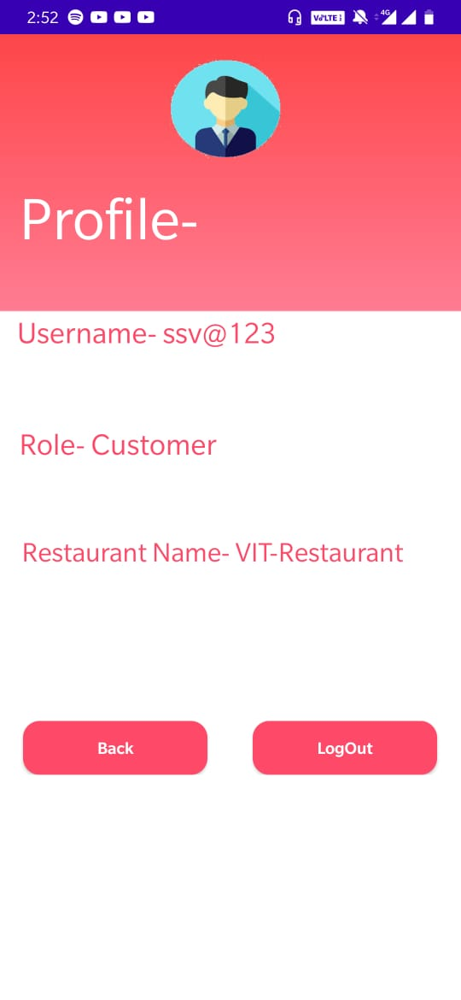
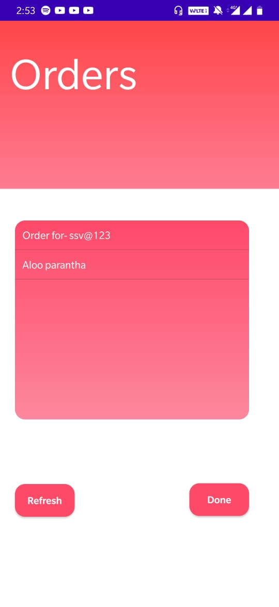

# Zomato-Clone-Foodato
# This is an app which i made in a span of a week and through which i have tried to clone a possible rugged version of zomato app but with some added functionalities.
**For storing the information about all the entities and to create all the data tables i have used parse in the project**

In the zomato app we see that it supports for the major part only the functionality that helps the customer to place the order whiile through my app i had aimed to also include a restaurant management system in the app with the added functionality to support the customer needs. 
 

 

1.So to register a restaurant any admin can register one using the option present in the landing page of the app, there the person is required to set his/her id and password , the name of the restaurant and for all the entities in the restaunrant like a delivery boy, cashier, chef a common password which they will have to use to sign in into thier accounts. 

 
2.To sign in the person needs to feed in his/her username/password , the name of the organization and the role under which they are registering themselves in and also the common 
password that the admin must have set in for that role for that restaurant.**Also note that for a customer a common password is not needed**
 

 
**Now for the app there are mainly two functionalities-** 
1.Online orders- 
  This part of the project deals with the customer ordering for something from any restaurant registered into the app's database, so when a customer logins into the app first     screen that comes up is a select restaurant dropdown, after that customer has three options- ordering something, seeing the order status and viewing his/her profile, so the     person starts with ordering something from the restasurant's menu(**Please note that the menu is dynamic and which can be edited by the admin through his login page**), after     that the customer needs to feed in their address, and then the order is placed , the order's status can be checked from the check order status option from the customer menu       screen.
   

 

  
  The next part of the procedure is the chef recieving the order, if the chef asks for a new order from his/her profile, any one pending order comes up on his screen and only
  after completing it , he/she can ask for more.
 

 
  
  After this the notification for the order completion comes up on the delivery agent's screen, if the agent asks for one,(**Pls note that with all these steps the orde status 
  option in the customer page keeps on updating**), there the delivery agent can see the details of the order and the address to where it is meant to be delivered.
   
  

 

2.Offline orders- 
  The procedure that goes through into an offline order is pretty simple, the only difference being it only includes an interaction with the cashier and the chef only , here the
  cashier in a way acts like a customer with all the functionalities that had been provided to the customer, the cashier orders , the chef recieves the order and the completes it
  and prompts the cashier

Now for the most powerful entity- the admin- the admin can moniter all the processes happening in the restaurant and can also edit the menu of the restaurant.
 

